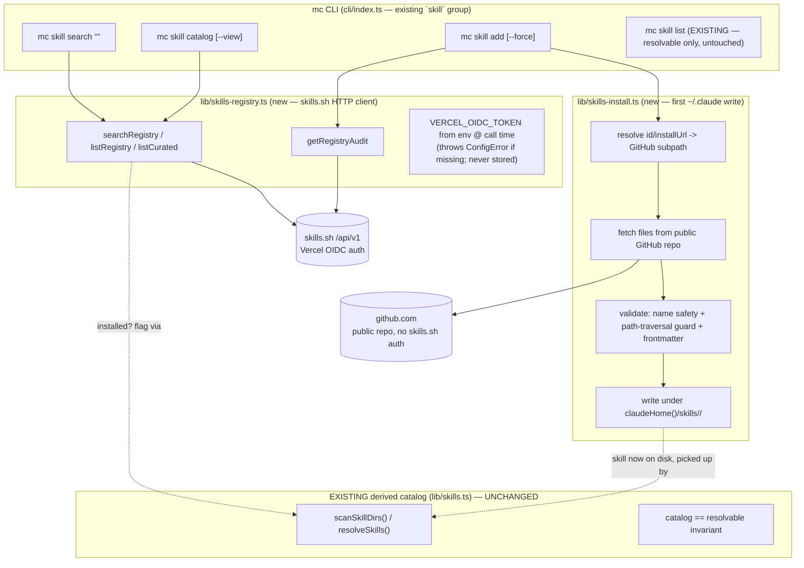
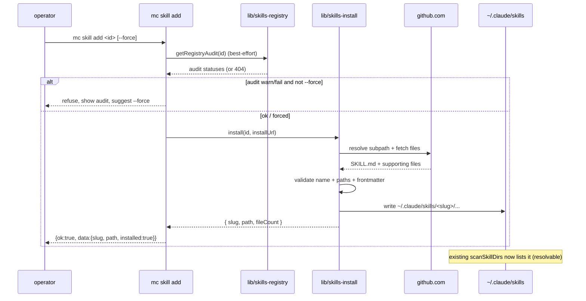

# feat: Integrate skills.sh as a discovery + install source for skills

## Summary

Add **skills.sh** (`https://skills.sh/api/v1/`) as a *source* the `mc` CLI can browse, search, and **install from**, so an operator can discover a Claude Code skill on the public registry and land it under `~/.claude/skills/<slug>/` with one command — after which Mission Control's existing derived catalog (`scanSkillDirs`) and spawn-time resolver pick it up unchanged.

The work mirrors the proven **Composio catalog four-layer template** (`lib/composio-api.ts` → catalog route → `mc mcp catalog` → `McpCatalogBrowser.tsx`), but lands **CLI-first** because `mc` runs on the operator's local machine and install is inherently a local-filesystem action. It introduces two new lib modules — a registry HTTP client and the project's **first filesystem-write-to-`~/.claude` capability** — and three new leaves on the existing `mc skill` command group.

This plan **consciously reverses two stated product boundaries** (see [Problem Frame](#problem-frame)): the prior skill-discovery brainstorms deferred "on-demand fetch/install of a missing skill from a remote" and declared "MC reports, never mutates user config / does not distribute skill content." The reconciliation that keeps us inside the existing model: skills.sh is treated purely as an **install source**, not a stored catalog MC owns. The "filesystem is the registry, catalog is derived, catalog == resolvable" invariants are preserved.

---

## Problem Frame

**Today:** profile `skills` are an enforced spawn-time contract; the available-skills catalog is *derived* by live-scanning `~/.claude/skills/` + work-dir `.claude/skills/` + enabled plugins (`lib/skills.ts`, `lib/plugin-skills.ts`, enforced in `daemon/runner.ts`). There is deliberately **no stored catalog** and **no install path** — a declared skill must already exist on disk or the run fails loudly (`MissingSkillError`). Getting a *new* skill onto disk is entirely manual (clone a repo, copy files, symlink).

**The gap:** skills.sh is a large public registry (8000+ skills) with search, a leaderboard, a curated set, full skill manifests, and third-party security audits. An operator who wants a new capability has no in-product way to find it or install it. They must leave `mc`, find a repo, and hand-place files correctly.

**What this enables:** `mc skill search <q>` / `mc skill catalog` to discover, and `mc skill add <id>` to install — the discovered skill becomes immediately resolvable by the existing catalog and usable in a profile's `skills` list.

### The two boundaries this reverses (call them out explicitly)

1. **"On-demand fetch/install from a remote" was Deferred** (`docs/brainstorms/2026-06-05-profile-skill-discovery-requirements.md`, `docs/brainstorms/2026-06-06-plugin-skill-resolution-requirements.md`, both Scope Boundaries → Deferred for later). This plan implements exactly that deferred item. That is a legitimate evolution, taken deliberately — the same way the plugin-resolution brainstorm explicitly reversed its own AE4.
2. **"MC reports, never mutates user config / does not distribute skill content."** `mc skill add` *writes* files into `~/.claude/skills/`. **Reconciliation:** MC still does not *host* or *distribute* content (content is fetched from the skill's public GitHub repo, not served by MC) and does not edit `enabledPlugins`/settings. It performs one narrow, explicit, operator-invoked write: placing fetched skill files on disk. The derived catalog and shared existence predicate then treat the result identically to a hand-placed skill — no new "stored catalog" concept enters the system.

---

## Decisions Confirmed With User (2026-06-07)

- **Scope:** discovery **+** install (not discovery-only).
- **Install content source:** the skill's **GitHub `installUrl`** (public repo) — *not* the skills.sh detail file-tree API, *not* shelling out to `npx skills add`. Rationale (user): content fetch needs no skills.sh auth and matches what `npx skills add` does.
- **Primary surface:** **local CLI** ("mc typically runs locally"). A web "Skills" tab is **deferred** — see [Scope Boundaries](#scope-boundaries).

---

## Key Technical Decisions

### KTD1. skills.sh requires auth on every endpoint → read a Vercel OIDC token from host env (the `COMPOSIO_API_KEY` pattern)

Verified live: **all** `/api/v1/*` endpoints return `HTTP 401 {"error":"authentication_required"}` unauthenticated — auth is mandatory for reads, not just a higher rate tier. Auth is a Vercel OIDC token via `Authorization: Bearer <token>` (or `x-vercel-oidc-token`).

Because `mc` runs locally (off-Vercel), the token cannot be minted in-process. Mirror the existing secret convention exactly (`lib/composio-api.ts:57` reads `process.env.COMPOSIO_API_KEY`, throws if unset, never persists):

- `lib/skills-registry.ts` reads `process.env.VERCEL_OIDC_TOKEN` **at call time**, throws a typed `ConfigError` (CLI exit 4) with a message pointing at `vercel env pull` when missing, and **never** writes it to the DB or any file.
- Document the acquisition path in the CLI help + README: `vercel link` then `vercel env pull` populates `VERCEL_OIDC_TOKEN` locally; tokens rotate ~12h and the Vercel helper refreshes them.

> Note: the token requirement applies only to **discovery** (search/catalog/curated/detail). **Install content** comes from public GitHub (KTD3) and needs no skills.sh token — so `mc skill add <id>` where the operator already knows the id can, in principle, run without a token if id→repo can be resolved without the detail endpoint (see KTD3 for why a token may still be needed to resolve the in-repo subpath).

### KTD2. skills.sh is an *install source*, never a stored catalog — preserve "catalog == resolvable"

The remote registry is a **third concept**: *installable-but-not-yet-present*. It must stay distinct from `mc skill list` (which promises *resolvable* — the catalog == resolvable invariant in `lib/skills.ts`'s shared `skillFilePresent` predicate). Therefore:

- New discovery lives under **new** leaves (`mc skill search`, `mc skill catalog`) — never folded into `mc skill list`.
- Discovery results carry an **`installed`** flag computed by checking the local derived catalog (`scanSkillDirs` by slug) — the analog of the Composio catalog's `connected` flag.
- After `mc skill add`, the skill flows through the *existing* derived catalog with zero divergence; no registry row is stored.

### KTD3. Install = fetch the skill's directory from its GitHub repo, validated, written under `claudeHome()`

`id` has the shape `{owner}/{repo}/{slug}` and `installUrl` points at `https://github.com/{owner}/{repo}`. The skill content lives at a **subpath** inside that repo (verified: `vercel-labs/skills` keeps skills at `skills/<slug>/SKILL.md`). The one genuinely non-trivial piece is resolving that subpath from `id`/`installUrl` alone.

**Resolution strategy (in priority order), to be confirmed against the open-source resolver in `vercel-labs/skills` `src/` at implementation time:**
1. Walk the repo tree via the GitHub API (`GET /repos/{owner}/{repo}/git/trees/{branch}?recursive=1`) and locate the directory whose `SKILL.md` frontmatter `name`/slug matches the requested slug (handles `skills/<slug>/`, root-level single-skill repos, and other layouts).
2. Fetch each file under that directory via the GitHub contents/raw API.
3. **Documented fallback:** if GitHub resolution proves unreliable, the skills.sh **detail endpoint** (`GET /skills/{id}`) returns the authoritative `files: [{path, contents}]` tree (needs the OIDC token). Keep this as a fallback, not the primary path, per the user's choice.

**Write path:** route every write through `claudeHome()` / `userSkillsDir()` (the `MC_CLAUDE_HOME`-overridable seam in `lib/skills.ts`) so installs land in `~/.claude/skills/<slug>/` and are redirectable to a tmp fixture under test.

**GitHub auth:** public-repo reads work unauthenticated at low volume; if `gh`/a `GITHUB_TOKEN` is present in env, use it to lift rate limits (read-only, env-only — never stored). Unauthenticated is the baseline.

### KTD4. Install safety — path-traversal guard + surface the skills.sh audit

Writing remote content to disk is a supply-chain surface. Two non-negotiable guards:

- **Per-file path sanitization:** every fetched file `path` is validated before write — reject absolute paths, `..` traversal, and anything escaping the target `~/.claude/skills/<slug>/` dir. Reuse/extend the spirit of `assertSafeSkillName` (`lib/skills.ts`) for the skill name, and add an explicit path-join guard for file paths within the skill.
- **Validate before commit:** parse the downloaded `SKILL.md` frontmatter (`parseSkillFrontmatter`) and require a usable `name`; refuse to install a skill with no valid `SKILL.md`.
- **Surface the audit:** `mc skill add` fetches `GET /skills/audit/{id}` (best-effort; 404 = no audit yet) and prints the partner audit statuses; if any audit is `fail`/`warn` (or `riskLevel` ≥ HIGH), require an explicit `--force` (or interactive confirm in TTY) before writing. Discovery (`mc skill catalog`/`search`) may also surface a compact audit/`featured` flag.

### KTD5. Discovery commands skip the DB; install is a CLI-local action (no DB row, no run)

Like `mc mcp catalog`, the new leaves are external/filesystem actions: they must **not** call `loadDb()`/`ensureDbCredentials()`. `mc skill add` writes to the local filesystem only — it creates **no** `runs`/`tasks`/DB row (unlike `mc mcp connect`, which writes a DB connection row). This keeps the scoped `mc_agent` credential out of the path entirely.

### KTD6. Thin projection types between the raw API and our surface

Mirror `ToolkitSummary`: define `RegistrySkill` (`id`, `slug`, `name`, `source`, `installs`, `sourceType`, `installUrl`, `url`, plus computed `installed`, and optional `featured`) and a separate `RegistrySkillDetail` only if the detail endpoint is used as the KTD3 fallback. Filter `isDuplicate: true` entries from listings (registry convention: forks/copies).

---

## High-Level Technical Design

Layering (CLI-first; web tab deferred):



Install sequence for `mc skill add vercel-labs/skills/find-skills`:



---

## Output Structure

New files (repo-relative):

```
lib/
  skills-registry.ts        # skills.sh HTTP client + projection types + typed errors
  skills-install.ts         # GitHub content resolver + validate + write under claudeHome()
test/
  skills-registry.test.ts   # fetch mocked
  skills-install.test.ts    # GitHub fetch mocked + MC_CLAUDE_HOME tmp fixture
  skill-registry-cli.test.ts # new CLI leaves (search/catalog/add)
```

Modified: `cli/index.ts` (new leaves on the existing `skill` group + `SPEC` entries), `AGENTS.md` (mc surface), `cli/README.md`.

---

## Implementation Units

### U1. skills.sh registry client — `lib/skills-registry.ts`

**Goal:** A plain-`fetch` HTTP client for skills.sh discovery, mirroring `lib/composio-api.ts`.
**Requirements:** KTD1, KTD6.
**Dependencies:** none.
**Files:** `lib/skills-registry.ts` (new), `test/skills-registry.test.ts` (new).
**Approach:**
- Functions: `searchRegistry({ q, limit })` → `GET /api/v1/skills/search`; `listRegistry({ view, page, perPage })` → `GET /api/v1/skills`; `listCurated()` → `GET /api/v1/skills/curated`; `getRegistryAudit(id)` → `GET /api/v1/skills/audit/{id}` (returns `null` on 404). Optional `getRegistrySkillDetail(id)` only as the KTD3 fallback.
- Private `skillsFetch(path)` wrapper injects `Authorization: Bearer ${token}` where `token = requireOidcToken()` reads `process.env.VERCEL_OIDC_TOKEN` at call time; throws `ConfigError` (typed, exit 4) with a `vercel env pull` hint when missing; throws `SkillsRegistryError` (new class carrying HTTP status) on non-2xx. No SDK, no module-scope token read.
- Projection: map raw responses to `RegistrySkill` (KTD6); filter `isDuplicate: true`. Expose pagination passthrough (`page`, `perPage`, `total`, `hasMore`).
**Patterns to follow:** `lib/composio-api.ts` (`composioFetch`, `ComposioApiError`, `listToolkits`, `ToolkitSummary`); error classes in `lib/validation.ts`.
**Execution note:** Start test-first against the documented response shapes (mock `fetch`); pin the exact field names from the API reference.
**Test scenarios:**
- `searchRegistry` returns mapped `RegistrySkill[]` for a 200 body; preserves `query`/`searchType`/`count`. (happy)
- `listRegistry` maps the `data`/`pagination` envelope; `view=hot` retains `installsYesterday`/`change` if present. (happy/edge)
- `isDuplicate: true` items are filtered out. (edge)
- Missing `VERCEL_OIDC_TOKEN` → `ConfigError` with the `vercel env pull` hint, **before** any network call. (error)
- 401/429/503 responses → `SkillsRegistryError` carrying the status; 429 surfaces `Retry-After` if present. (error)
- `getRegistryAudit` returns `null` on 404, parsed audits on 200. (edge/happy)

### U2. Discovery CLI — `mc skill search` & `mc skill catalog`

**Goal:** Two read-only leaves on the existing `skill` group that browse/search the registry and flag locally-installed skills.
**Requirements:** KTD2, KTD5.
**Dependencies:** U1.
**Files:** `cli/index.ts` (extend the `skill` group ~line 1541; add `SPEC` entries ~line 378), `test/skill-registry-cli.test.ts` (new).
**Approach:**
- `mc skill search <q> [--limit <n>]` → `searchRegistry`; `mc skill catalog [--view all-time|trending|hot] [--search <q>] [--limit <n>]` → `listRegistry`/`listCurated`. Both **skip `loadDb()`** (KTD5).
- Compute an `installed: boolean` per result by scanning the local derived catalog (`scanSkillDirs([userSkillsDir(), ...])`) and matching by slug — the analog of the Composio `connected` flag. Never mutate or read `mc skill list`'s output contract.
- Standard JSON envelope `data: { items, count }` via `emit()`; add a `--human` renderer (mirror `mc mcp catalog`) showing name, source, installs, and `installed`/`featured` markers.
- Register both in `SPEC` with `readonly: true`.
**Patterns to follow:** `mc mcp catalog` handler (`cli/index.ts` ~843–862); `SPEC`/`emit`/`withFlags`/`isJson`; `mc skill list` (~1543–1571) for the `scanSkillDirs` call.
**Test scenarios:**
- `mc skill search react --json` → `{ ok:true, command:'skill search', data:{ items, count } }`; items carry `installed`. (happy)
- A slug present in the (fixture) local skills dir is flagged `installed:true`; absent → `false`. (Covers KTD2 separation.) (edge)
- Neither command triggers DB credential resolution (run with no `AGENT_DATABASE_URL`; still succeeds with a mocked registry). (integration)
- Registry `ConfigError` (no token) surfaces as exit 4 / `{ ok:false, error:{ code:'CONFIG' } }`. (error)
- `--human` renders a non-JSON table without throwing. (happy)

### U3. Skill installer — `lib/skills-install.ts`

**Goal:** Resolve a skill's GitHub content from its `id`/`installUrl`, validate it, and write it under `~/.claude/skills/<slug>/` — the project's first `~/.claude` write.
**Requirements:** KTD3, KTD4.
**Dependencies:** U1 (types).
**Files:** `lib/skills-install.ts` (new), `test/skills-install.test.ts` (new).
**Approach:**
- `installSkill({ id, installUrl, force })` → `{ slug, path, fileCount }`.
- **Resolve subpath:** parse `id` into `{ owner, repo, slug }`; walk the GitHub tree (`git/trees/{branch}?recursive=1`) to find the dir whose `SKILL.md` matches the slug (KTD3 strategy 1); fall back to root-level single-skill layout. Confirm the resolver behavior against `vercel-labs/skills` `src/` during implementation.
- **Fetch** each file under that dir from GitHub (raw/contents); use `GITHUB_TOKEN` from env if present (read-only, never stored).
- **Validate (before any write):** `assertSafeSkillName(slug)`; per-file path-traversal guard (reject absolute/`..`/escaping target); `parseSkillFrontmatter(SKILL.md)` must yield a `name`. Refuse if no valid `SKILL.md`.
- **Conflict:** if `userSkillsDir()/<slug>/` already exists, refuse unless `force` (then overwrite atomically — write to a temp dir, then rename/replace).
- **Write:** `mkdirSync(recursive)` + `writeFileSync` under `userSkillsDir()` (via `claudeHome()` seam). No symlinks created by us (but the catalog already tolerates symlinked installs).
**Patterns to follow:** path helpers + guards in `lib/skills.ts` (`claudeHome`, `userSkillsDir`, `assertSafeSkillName`, `parseSkillFrontmatter`); the only existing FS-write precedent (`daemon/runner.ts` temp-file write/cleanup) for the temp-then-rename shape.
**Execution note:** Test-first with the `MC_CLAUDE_HOME` tmp fixture (as in `test/skills.test.ts`) and a mocked GitHub fetch; characterize the subpath resolver against a recorded `vercel-labs/skills` tree fixture before writing the fetch path.
**Test scenarios:**
- `vercel-labs/skills/find-skills` resolves to `skills/find-skills/` and writes `SKILL.md` (+ any supporting files) under the tmp skills dir; returns correct `fileCount`. (happy / Covers KTD3)
- Root-level single-skill repo layout resolves correctly. (edge)
- A fetched file path containing `..` or an absolute path is **rejected** and **nothing is written**. (error / Covers KTD4)
- A skill name failing `assertSafeSkillName` is rejected before any network/FS work. (error)
- Missing/invalid `SKILL.md` frontmatter → refuse, no partial write. (error)
- Existing skill dir without `--force` → `ConflictError` (exit 1), original untouched; with `--force` → atomic overwrite, no half-written state on simulated mid-write failure. (edge/integration)
- All writes land under `claudeHome()` (assert the tmp fixture received them; nothing escapes it). (integration)

### U4. Install CLI — `mc skill add`

**Goal:** The operator-facing install command, with audit gating.
**Requirements:** KTD4, KTD5.
**Dependencies:** U3, U1 (audit).
**Files:** `cli/index.ts` (new `skill add` leaf + `SPEC` entry), `test/skill-registry-cli.test.ts` (extend).
**Approach:**
- `mc skill add <id|installUrl> [--force]`. **Skips `loadDb()`** (KTD5). If given a bare `id`, derive `installUrl` from it (or resolve via the registry); if given a full GitHub URL, parse it.
- Best-effort `getRegistryAudit(id)`; if any audit is `warn`/`fail` (or risk ≥ HIGH) and not `--force`: in a TTY, prompt; non-TTY, refuse with a clear message and a non-zero exit. Print audit statuses regardless.
- On success: `emit` `{ ok:true, command:'skill add', data:{ slug, path, fileCount, installed:true } }`.
- Register in `SPEC` (`readonly: false`).
**Patterns to follow:** mutation-style command shape in `cli/index.ts` (returns the affected entity); `mc mcp connect` for the "external action that prints a follow-up" shape; `classify()` for exit-code mapping (`ConflictError`→1, `ValidationError`→2, `ConfigError`→4).
**Test scenarios:**
- `mc skill add <id> --json` on a clean fixture → `data.slug`/`data.path`/`installed:true`; file present on the tmp fixture afterward. (happy)
- A `fail` audit without `--force` in non-TTY → refusal, non-zero exit, nothing written. (error / Covers KTD4)
- `--force` past a `warn` audit installs and still prints the audit. (edge)
- Already-installed slug without `--force` → exit 1 `CONFLICT`. (edge)
- Audit endpoint 404 (no audit yet) → install proceeds, prints "no audit available". (edge)
- Command runs without DB credentials configured. (integration / Covers KTD5)

### U5. Docs + surface registration

**Goal:** Update the agent-facing CLI reference and record the boundary reversal.
**Requirements:** all KTDs.
**Dependencies:** U1–U4.
**Files:** `AGENTS.md` (the `mc` command block), `cli/README.md`.
**Approach:**
- Add `mc skill search`, `mc skill catalog`, `mc skill add` to the `AGENTS.md` command reference with the env-token note (`VERCEL_OIDC_TOKEN` via `vercel env pull`), the "installs to `~/.claude/skills/`, no DB row" note, and the audit-gating behavior. Note that discovery is *installable-but-not-present* and is distinct from `mc skill list` (resolvable).
- Update `cli/README.md` similarly; document the host-env token + GitHub-content model and the path-traversal/audit safety guards.
- One sentence recording that this deliberately implements the previously-deferred remote-install boundary.
**Test scenarios:** `Test expectation: none — documentation only.`

---

## Scope Boundaries

### In scope
- CLI discovery (`mc skill search`, `mc skill catalog`) + install (`mc skill add`) from skills.sh, content fetched from public GitHub.
- Host-env OIDC token (read-only, never stored); path-traversal + frontmatter + name-safety guards; audit surfacing/gating.

### Deferred to Follow-Up Work
- **Web "Skills" tab** (`SkillsTab.tsx` + `app/api/projects/[slug]/skills/...` + `page.tsx` registration). Deferred because install is a local-filesystem action and the Vercel web server's disk is not the operator's `~/.claude/skills/`; a web tab could do *discovery* (OIDC is native on Vercel) but not install, so it's a separate, lower-value slice.
- **`mc skill remove <slug>`** (uninstall) — natural companion, not required for the discover→install→use loop.
- **Profile-driven auto-install** (declaring a skill in a profile auto-fetches it at spawn). Larger behavior change to the enforced contract; keep `MissingSkillError` loud for now.
- **Install telemetry back to skills.sh** (the registry tracks dedup install counts). Not in the documented API; out of scope.

### Outside this product's identity
- MC **hosting or distributing** skill content (content always comes from the source repo, never MC).
- MC editing `enabledPlugins`/settings or otherwise mutating user config beyond the single explicit skill-file write.
- A **stored** registry/catalog table in the DB — the catalog stays derived from disk.

---

## Risks & Mitigations

- **OIDC token friction for local CLI** (12h rotation, requires `vercel link`/`env pull`). *Mitigation:* clear `ConfigError` with the exact acquisition command; install content path avoids the token entirely (GitHub). *Open:* confirm whether `npx skills`/`find-skills` use a non-OIDC public path we could adopt (see Open Questions).
- **GitHub subpath resolution is layout-dependent** (the riskiest piece). *Mitigation:* tree-walk by matching `SKILL.md`→slug rather than assuming `skills/<slug>/`; confirm against the open-source `vercel-labs/skills` resolver; keep the skills.sh detail file-tree as a documented fallback.
- **Supply-chain risk** writing remote content to disk that later becomes agent steering. *Mitigation:* path-traversal guard, frontmatter validation, audit gating with `--force`, explicit operator invocation, no execution by `mc` itself.
- **GitHub rate limits** on unauthenticated tree/content reads. *Mitigation:* optional `GITHUB_TOKEN` from env; small per-skill footprint.
- **Reversing a documented boundary** could surprise. *Mitigation:* explicit Problem Frame call-out + a recorded note in docs; the reconciliation keeps every derived-catalog invariant intact.

---

## Alternatives Considered

- **Web-tab-first** (OIDC native on Vercel). Rejected: `mc` runs locally and install must touch the operator's disk; a web tab can't install. Kept as a deferred discovery-only follow-up.
- **Install via the skills.sh detail file-tree API** (single source, authoritative paths). Not chosen by the user (needs the OIDC token for content and re-implements an installer); retained as the KTD3 fallback for subpath resolution.
- **Shell out to `npx skills add`.** Rejected by the user: adds an npx/node runtime dependency and cedes control over where files land.
- **A stored registry/catalog table.** Rejected: breaks the "catalog is derived / catalog == resolvable" invariant central to `lib/skills.ts`.

---

## Open Questions

- **Is there a non-OIDC public read path?** `npx skills`/`find-skills` are widely used without Vercel — confirm whether they hit a different unauthenticated endpoint or carry a bundled/public token. If so, prefer it for discovery and drop the OIDC friction. *(Resolve before/early in U1 by reading `vercel-labs/skills` `src/`.)*
- **Exact GitHub subpath convention across source repos** — resolve empirically against `vercel-labs/skills` `src/` and 2–3 other popular sources during U3. *(Execution-time; documented strategy + fallback above.)*
- **Token env var name** — standardize on `VERCEL_OIDC_TOKEN` (what `vercel env pull` emits) vs. an `MC_`-prefixed override. Default: `VERCEL_OIDC_TOKEN`, optional `MC_` override if a collision shows up.

---

## Sources & Research

- skills.sh API reference (`https://skills.sh/docs/api`) — endpoints, auth (Vercel OIDC), response shapes, audit endpoint. Live-probed: all endpoints 401 unauthenticated; `vercel-labs/skills` keeps skills at `skills/<slug>/SKILL.md`.
- Composio catalog four-layer template — `lib/composio-api.ts`, `app/api/projects/[slug]/composio/catalog/route.ts`, `cli/index.ts` (`mc mcp catalog`), `components/McpCatalogBrowser.tsx`.
- Existing skill model — `lib/skills.ts`, `lib/plugin-skills.ts`, `daemon/runner.ts`, `daemon/render-profile.ts`; `mc skill list` at `cli/index.ts` ~1541.
- Reversed boundaries — `docs/brainstorms/2026-06-05-profile-skill-discovery-requirements.md`, `docs/brainstorms/2026-06-06-plugin-skill-resolution-requirements.md` (Scope Boundaries → Deferred for later; "MC reports, never mutates").
- Test seams — `test/skills.test.ts` (`MC_CLAUDE_HOME` fixture), `test/composio-catalog.test.ts`, `test/skill-list-cli.test.ts`.
- Repo gates — lint is eslint; tests hit the real Neon dev branch; no `CONTRIBUTING.md` (slice-plan format is the convention); scope `git add` and audit the squash diff.
